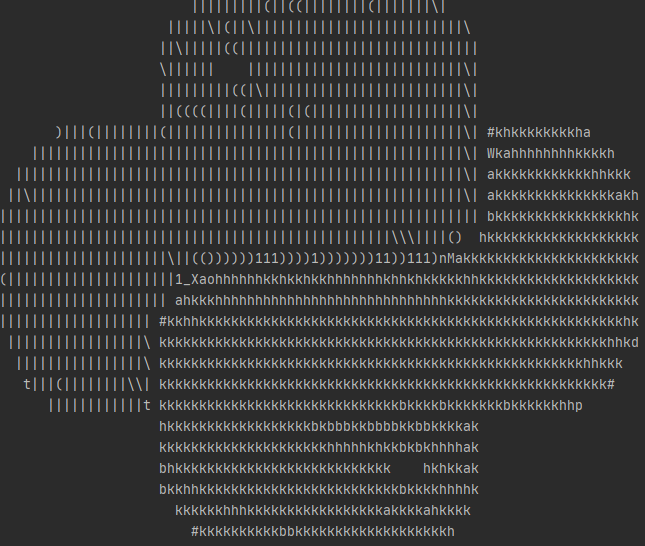

# img2text

A lightweight module to generate colorful ascii art from images

To install img2text:
```python
pip install img2text
```

## How To Use
Let's use the python logo as reference:


To generate an ascii image

```python
from img2text import img_to_ascii

ascii_img = img_to_ascii('data/python.png', width=80)
print(ascii_img)
```

We obtain the following:



### Adding Color
We can customize this further by adding color (to be shown in the console):

```python
from img2text import img_to_ascii

ascii_img = img_to_ascii('data/python.png', width=80, colorful=True)
print(ascii_img)
```

We obtain the following:


### Customizing Output
We can reverse the intensity of the image by setting `reverse` to True

```python
from img2text import img_to_ascii

ascii_img = img_to_ascii('data/python.png', width=80, colorful=True, reverse=True)
print(ascii_img)
```

We obtain the following:


We can get a slightly brighter image by adding the `bright` option which sets the characters to bold:

```python
from img2text import img_to_ascii

ascii_img = img_to_ascii('data/python.png', width=80, colorful=True, reverse=True, bright=True)
print(ascii_img)
```

We obtain the following:


You can also change the character set by providing a custom string of characters that increase in intensity:
```python
from img2text import img_to_ascii

chars = r" ░▒▓█"

ascii_img = img_to_ascii('data/python.png', width=80, colorful=True, bright=True, chars=chars)
print(ascii_img)
```

We obtain the following:


### Exporting ASCII image to a file
It's also possible to export the result to a text file, so you can print its content using the `cat` command for example
To do this all you need to do is to write the content to a file:

```python
from img2text import img_to_ascii

ascii_img = img_to_ascii('data/python.png', width=80, colorful=True)

with open('logo.ascii', 'w') as f:
    f.write(ascii_img + '\n')
```

or using the CLI:

```bash
img2text -cw 80 -o logo.ascii data/python.png
```

### Additional Options
- Customize the width and height by providing the number of columns/lines to use
- Customize the aspect ratio by providing `ar_coef` coefficient. The default value is set to 2.4
but depending on the console you are using it might be interesting to try out values from [2, 3]
- You can add a Background Color by setting `bg_color` to one of the following values:
    - BLACK
    - RED
    - GREEN
    - YELLOW
    - BLUE
    - MAGENTA
    - CYAN
    - WHITE
